# 
🧪 ARCHDEVIL PLAYGROUND 🧪

  

  

**🔥 Your Reality is Malleable. The Web is Your Canvas. This is Your Brush. 🔥**

*yet another exploit shit.*

---

  

### 🔥 **ULERR** 🔥

  

### ⚡ **SYSTEM ARCHITECTURE** ⚡

```mermaid
graph TD
    A[🎯 User Interface]
    A --> B[💉 Userscript Engine]
    A --> C[⛓️ Security Bypass]
    A --> D[🔬 DevTools Interface]
    B --> E[📱 Android System]
    C --> E
    D --> E
    E --> F[🌐 Web Content]
    F --> G[🎨 Enhanced Experience]
```

  

## 👨‍💻 About the Developer

**Engineered with rebellious precision by [@ArCHDeViL](https://github.com/muhammadfadelalexander)**

*"In a world of locked doors, we create the keys."*

  

### 🎯 **FINAL TRANSMISSION**

---

  🔥 Built with passion, 0xArCHDeViL 🔥

